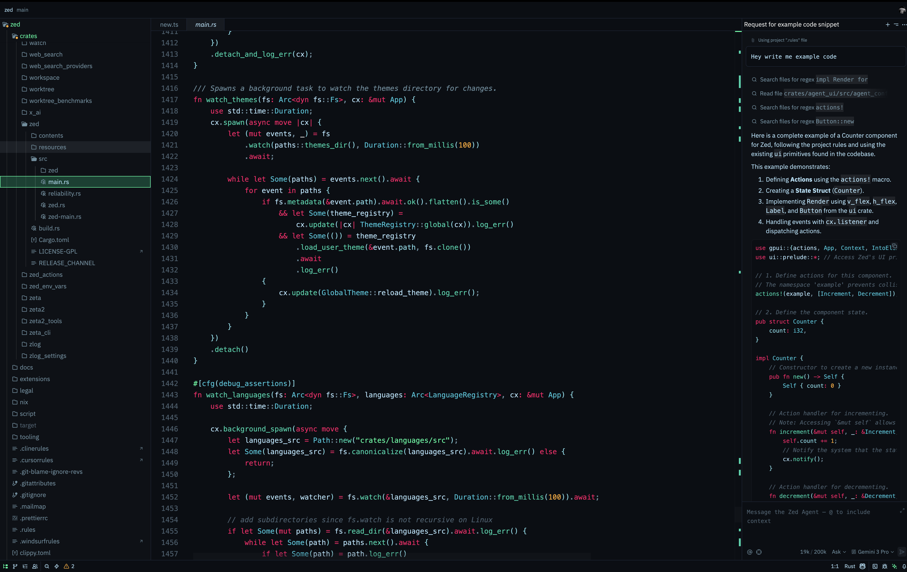
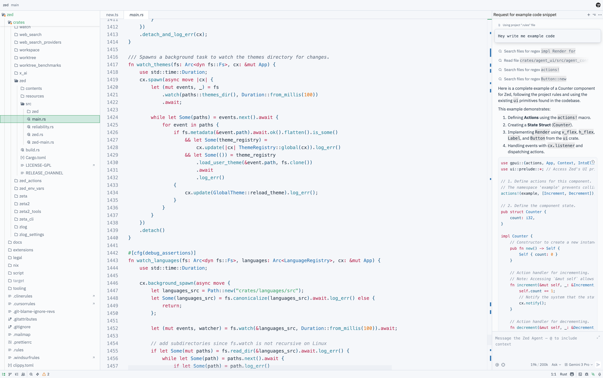

# Ghost in the Shell Theme for Zed

A cyberpunk-inspired theme for Zed editor based on Ghost in the Shell.

## Screenshots

### Dark


### Light


## Installation

Copy the theme file to your Zed themes directory:

**macOS/Linux:**
```bash
cp themes/ghost-in-the-shell.json ~/.config/zed/themes/
```

**Windows:**
```bash
copy themes\ghost-in-the-shell.json %USERPROFILE%\AppData\Roaming\Zed\themes\
```

Restart Zed and select the theme via command palette (`Cmd+Shift+P` → "theme selector: toggle").
